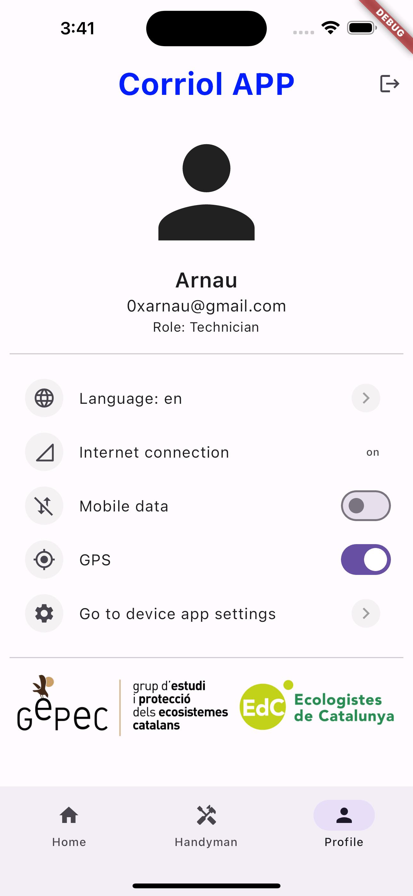

# corriol_app

This project is a mobile application (Android & iOS) called "Corriol APP." Its main purpose is to allow users (volunteers of [GePeC-EdC](https://gepec.cat)) to register observations of the "Corriol camanegre" bird species [[ca]](https://ca.wikipedia.org/wiki/Corriol_camanegre), [[es]](https://es.wikipedia.org/wiki/Charadrius_alexandrinus) & [[en]](https://en.wikipedia.org/wiki/Kentish_plover), and the "Corriol petit" bird species [[ca]](https://ca.wikipedia.org/wiki/Corriol_anellat_petit), [[es]](https://es.wikipedia.org/wiki/Charadrius_dubius) & [[en]](https://en.wikipedia.org/wiki/Little_ringed_plover). Users can record various details, such as the number of birds observed by gender and species, as well as their geographic location.

<p align="center">
   <a href="https://play.google.com/store/apps/developer?id=GEPEC-EdC" target="_blank" rel="noreferrer">
      
   </a>
   <a href="" target="_blank" rel="noreferrer">
      
   </a>
</p>

---

## Dependencies

1. [Flutter](https://docs.flutter.dev/get-started/install)
2. macOS, to be able to build the iOS app
   1. Ruby: [cocoapods](https://guides.cocoapods.org/using/getting-started.html#installation)
   2. [Xcode](https://developer.apple.com/xcode/)
3. [Android Studio](https://developer.android.com/studio)

## Installation & Configuration

To get started with the project, follow these steps:

1. Clone the repository.
2. Add the API_KEYs from [Google Maps](https://console.cloud.google.com/apis/dashboard?) to the .env file:
   1. GOOGLE_MAPS_API_KEY_ANDROID
   2. GOOGLE_MAPS_API_KEY_IOS
3. Firebase service:
   1. **Android**: place the `google-services.json` ([downloaded from the Firebase console, Android app project](https://console.firebase.google.com/)) to `android/app/`
   2. **iOS**: place the `GoogleService-Info.plist` ([downloaded from the Firebase console, iOS app project](https://console.firebase.google.com/)) to `ios/Runner/`

## Documentation

To generate documentation, use `dart doc .`, which will generate HTMLs. These can be accessed directly, but to make the search functionality work, you'll need to create a http server:

```shell
dart pub global activate dhttpd 
dhttpd --path doc/api # starts the server, ctrl-c to exit

dart pub global deactivate dhttpd  
```

## Key Features

- Bird Observation Recording: Users can specify the number of birds observed by gender (males, females, undetermined) and their predators.
- Users can view their records.
- Google Maps Integration: The application utilizes Google Maps to display the geographical location of registered observations.
- Preference Settings: Users can customize their preferences in the app, such as language, mobile data usage and location permission.
- Technicians can view all records (grouped by locality) made by all users and download them as CSV files.

## Build the App (coming soon)

## Screenshots

<div style="display: flex; justify-content: space-between;">
  
  
  
</div>

<div style="display: flex; flex-wrap: wrap; justify-content: center;">
  
  
  
  
</div>
